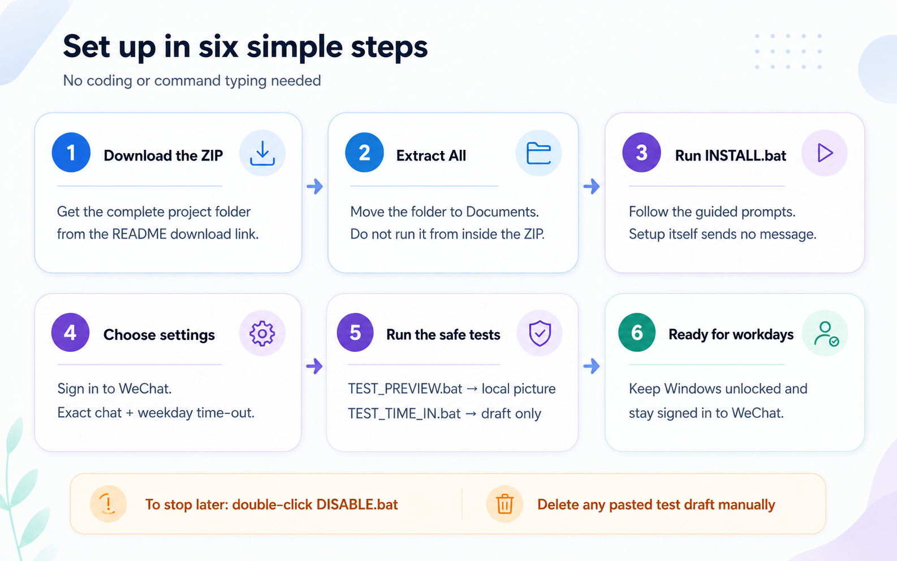
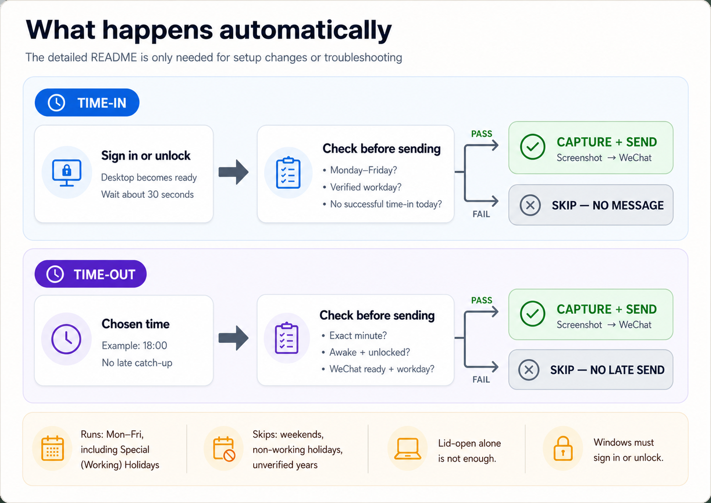

# WeChat Attendance Screenshot Automation

A Windows desktop automation that opens the Windows date/time flyout, captures
the bottom-right corner of the primary display, and sends the image to a chosen
WeChat or Weixin conversation. It provides an automatic time-in after the
current user signs in to or unlocks Windows and an automatic weekday time-out
at a configured clock time.

> [!IMPORTANT]
> This project controls the Windows desktop with simulated mouse and keyboard
> input. The computer must be awake, unlocked, and signed in to WeChat when the
> automation runs.

## Visual quick start

This is the short version for non-coders. Follow this section for normal setup
and daily use; the longer sections below are reference and troubleshooting.

> [!TIP]
> [Download the complete project ZIP](https://github.com/stevenzct/wechat-automate/archive/refs/heads/main.zip),
> select **Extract All**, and keep the extracted folder in a permanent place
> such as `Documents`. You never need to open a `.py` or `.ps1` file.

### Set up once

[](docs/quick-start.png)

Select the diagram to open it full size; on a phone, select it and zoom. After
setup, there is no daily button to press.

### What happens automatically

[](docs/daily-automation.png)

Select the diagram to open it full size; on a phone, select it and zoom.

### Which file should I double-click?

| Order | File | What it does | Intentional send? |
| --- | --- | --- | --- |
| 1 — Set up | `INSTALL.bat` | Installs or updates both automatic tasks. | No |
| 2 — Check the picture | `TEST_PREVIEW.bat` | Saves and opens the screenshot locally without opening WeChat. | No |
| 3 — Test time-in | `TEST_TIME_IN.bat` | On an eligible workday, pastes a draft in the chosen chat. Verify it, then delete it. | No; draft-only mode omits `Alt+S` |
| Optional — Test the chat any day | `TEST_DRAFT.bat` | Pastes a general draft without applying workday rules. | No; draft-only mode omits `Alt+S` |
| Stop automation | `DISABLE.bat` | Disables both tasks without deleting settings or logs. | No |

Clear existing chat input before a draft test. Draft-only automation still uses
WeChat search keys, so inspect the selected chat and delete the pasted draft.
`TEST_TIME_IN.bat` intentionally creates nothing on a weekend, nationwide
non-working holiday, or unverified holiday year.

### Will it run today?

| Situation | Automatic result |
| --- | --- |
| Normal Monday–Friday | Time-in once after sign-in/unlock; time-out at the selected minute |
| Saturday or Sunday | Both skip |
| Nationwide Regular or Special (Non-Working) Holiday | Both skip |
| Special (Working) Holiday | Both run normally |
| Holiday year cannot be verified | Both skip rather than guess |
| Laptop opens but Windows remains locked | Time-in does not start |
| Computer is asleep or locked at the time-out minute | Time-out skips and is not sent late |

> [!NOTE]
> Only nationwide Philippine holidays are checked. For either automatic
> message, keep Windows awake and unlocked, stay signed in to WeChat, and leave
> the mouse and keyboard alone briefly. Opening the lid alone is not the
> time-in trigger—Windows must complete sign-in or unlock.

Need more help? Jump to [Easiest setup for non-coders](#easiest-setup-for-non-coders),
[Safety, privacy, and limitations](#safety-privacy-and-limitations), or
[Troubleshooting](#troubleshooting).

## Contents

- [Visual quick start](#visual-quick-start)
- [Features](#features)
- [How it works](#how-it-works)
- [Requirements](#requirements)
- [Easiest setup for non-coders](#easiest-setup-for-non-coders)
- [Manual setup with PowerShell](#manual-setup-with-powershell)
- [Safe testing workflow](#safe-testing-workflow)
- [Install the scheduled tasks](#install-the-scheduled-tasks)
- [Philippine holiday rules](#philippine-holiday-rules)
- [Configuration](#configuration)
- [Command-line reference](#command-line-reference)
- [Manage the scheduled tasks](#manage-the-scheduled-tasks)
- [Logs and exit codes](#logs-and-exit-codes)
- [Safety, privacy, and limitations](#safety-privacy-and-limitations)
- [Troubleshooting](#troubleshooting)
- [Project structure](#project-structure)
- [Development and verification](#development-and-verification)
- [License](#license)

## Features

- Captures a configurable bottom-right screen region with the Windows calendar
  open; the default crop is `500 × 660` pixels.
- Supports full-primary-screen captures when required.
- Sends immediately, creates a safe unsent draft, or runs only during the
  scheduled clock minute.
- Sends time-in after the current user signs in or unlocks the workstation,
  with an approximately 30-second delay so the interactive desktop can settle.
- Records a successful time-in locally and sends at most one time-in per local
  calendar date, even if the workstation is unlocked repeatedly.
- Includes guided, double-clickable Windows helpers for installation, preview,
  and unsent draft testing.
- Installs separate time-in and time-out tasks through Windows Task Scheduler.
- Both installed automatic tasks skip Saturdays, Sundays, nationwide Philippine
  Regular Holidays, and Special (Non-Working) Holidays, while continuing on
  Special (Working) Holidays.
- Includes the verified 2026 calendar and refreshes later annual calendars from
  the Official Gazette after the government publishes them.
- Finds WeChat by the actual `WeChat.exe` or `Weixin.exe` process rather than by
  trusting a window title.
- Verifies that WeChat remains in the foreground before every keyboard action.
- Refuses to send if the date/time panel does not appear to have opened.
- Uses both a process mutex and Task Scheduler overlap protection to reduce the
  chance of duplicate sends.
- Accounts for Windows display scaling when clicking the taskbar clock.
- Writes operational details and errors to a local UTF-8 log file.

## How it works

1. The script confirms that an interactive Windows desktop is available.
2. It closes any existing flyout, records the target screen region, and clicks
   the primary taskbar clock.
3. It captures the configured region, then compares it with the image taken
   before the click. If the screen did not change enough, it stops instead of
   sending an ordinary desktop screenshot.
4. In preview mode, it saves the image locally and finishes.
5. In a send mode, it finds or starts WeChat, restores its main chat window,
   and verifies that the foreground process is really WeChat/Weixin.
6. It opens WeChat search with `Ctrl+F`, pastes the configured contact name,
   selects the first result, and pastes the screenshot as bitmap data.
7. Draft mode stops here. Otherwise, the script sends with `Alt+S` so it works
   regardless of the user's Enter-key preference in WeChat.

The installed automated tasks check the weekday and nationwide Philippine
holiday status before capture. The time-in task starts after the current user
signs in or unlocks the workstation, waits approximately 30 seconds, and sends
only if no successful time-in has already been recorded for that local date. It
does not trigger merely because the physical lid was opened; Windows must reach
a signed-in, unlocked interactive session.

The time-out task keeps the configured Monday-to-Friday clock time. By default,
a task scheduled for `18:00` may start during the `18:00` clock minute, but a
start at `18:01` or later is logged and skipped. Both tasks skip Regular
Holidays and Special (Non-Working) Holidays and continue on Special (Working)
Holidays.

## Requirements

- Windows 11 with the taskbar clock available on the primary display
- Python 3 and `pip`
- WeChat or Weixin desktop, installed and signed in
- An interactive user session at run time
- Permission to create scheduled tasks for the current Windows user

Python packages are listed in [`requirements.txt`](requirements.txt):

- `PyAutoGUI` for mouse, keyboard, and screen capture automation
- `Pillow` for image comparison and encoding
- `pyperclip` for pasting contact names
- `pywin32` for Windows window and clipboard APIs

This project is Windows-only. It uses `ctypes`, Win32 APIs, and Windows Task
Scheduler, so it will not run unchanged on macOS or Linux.

## Easiest setup for non-coders

No programming or command typing is required for the normal setup. The included
`.bat` files open guided windows and ask for the required information.

### Before you begin

The user only needs to download this project:

**[Download the complete project ZIP](https://github.com/stevenzct/wechat-automate/archive/refs/heads/main.zip)**

Open the downloaded ZIP, select **Extract All**, and move the extracted folder
to a permanent location such as `Documents`. Do not run `INSTALL.bat` from
inside the ZIP.

`INSTALL.bat` automatically checks for Python and WeChat/Weixin. If either app
is missing, it lists what is needed and asks the user to type `YES`. It then
downloads and installs the missing apps through the official Windows Package
Manager. A Windows permission prompt may appear.

The user does not need to find separate Python or WeChat download pages.
However, the following are still required:

- A Windows 11 computer with an internet connection
- Windows Package Manager (`winget`), normally included with Windows 11
- An existing WeChat/Weixin account
- A phone available to scan or approve the WeChat desktop sign-in

If Windows Package Manager is missing, `INSTALL.bat` opens the Microsoft Store
page for **App Installer**. Install or update it, then run `INSTALL.bat` again.

The project ZIP already includes every automation file a non-coder needs:

- `INSTALL.bat`
- `DISABLE.bat`
- `TEST_PREVIEW.bat`
- `TEST_TIME_IN.bat`
- `TEST_DRAFT.bat`
- `easy_setup.ps1`
- `setup_daily_task.ps1`
- `send_wechat_time.py`
- `philippine_holidays.py`
- `philippine_holidays.json`
- `requirements.txt`

Do **not** download Git, GitHub Desktop, PowerShell, Windows Task Scheduler, or
the Python packages individually. Git is unnecessary for normal use;
PowerShell and Task Scheduler are included with Windows; and `INSTALL.bat`
automatically installs PyAutoGUI, Pillow, pyperclip, and pywin32.

Complete this checklist before running the installer:

- [ ] The computer is running Windows 11 and connected to the internet.
- [ ] The user has a working WeChat/Weixin account and their phone nearby.
- [ ] The project ZIP has been fully extracted.
- [ ] The extracted project folder is in a permanent location.
- [ ] The user understands that WeChat sign-in must be completed manually.

If automatic installation reports that an app cannot be detected yet, restart
Windows once and run `INSTALL.bat` again.

### Step 1: Install time-in and time-out

Double-click [`INSTALL.bat`](INSTALL.bat). It performs the following steps:

1. Detect Python and WeChat/Weixin.
2. Ask permission to download and install any missing required apps.
3. Open WeChat and wait while the user signs in manually.
4. Ask for the contact and weekday time-out time.
5. Verify the Philippine holiday calendar.
6. Install the required Python packages and create the time-in and time-out
   scheduled tasks.

The guided installer asks for:

- The exact WeChat contact or group name
- The weekday time-out time, such as `18:00` for 6:00 PM

Review the displayed settings and type `YES` when asked to confirm. The helper
then installs the Python packages, checks the computer, and creates the
two scheduled tasks. Installation does not capture a screenshot or send a
WeChat message.

The choices are saved locally in `.wechat_easy_config.json` so the testing
helper can suggest the same contact. This file is excluded from Git and should
not be uploaded because it can contain a private contact or group name.

To change the contact or time-out time later, double-click `INSTALL.bat` again.
Both existing scheduled tasks will be updated.

### Step 2: Check the screenshot safely

Double-click [`TEST_PREVIEW.bat`](TEST_PREVIEW.bat), then stop using the mouse
and keyboard for a few seconds. The helper briefly opens the Windows calendar,
saves `timeout_screenshot_preview.png`, and opens the image for inspection.

This test does not open WeChat and cannot send a message. Check that the image
shows the intended calendar and does not include private notifications or other
unwanted information.

### Step 3: Verify the time-in flow safely

Open and sign in to WeChat, then double-click
[`TEST_TIME_IN.bat`](TEST_TIME_IN.bat). Confirm the contact and type `YES`.

This runs the same weekday and Philippine holiday checks as automatic time-in.
On an eligible workday, it captures the calendar and pastes it into the selected
conversation in draft-only mode. It does not invoke WeChat's `Alt+S` send
shortcut and never reads or changes `.wechat_last_time_in`, so it cannot consume
or replace the day's real time-in record. Clear any existing chat input before
starting; inspect the resulting draft, then delete it manually.

On Saturday, Sunday, a nationwide non-working holiday, or a year without a
verified holiday calendar, a successful test is an intentional skip: the
console explains why, and no screenshot or draft is created. Special (Working)
Holidays continue like ordinary workdays. This helper verifies the time-in
application path, but it does not simulate the Windows sign-in/unlock trigger,
the 30-second trigger delay, or a real message delivery.

### Step 4: Check the WeChat conversation on any day

Open and sign in to WeChat, then double-click
[`TEST_DRAFT.bat`](TEST_DRAFT.bat). Confirm the exact contact name and type
`YES` when prompted.

The helper captures the calendar, finds the conversation, and pastes the image
in draft-only mode without invoking `Alt+S`. Verify that the correct conversation
was selected, then delete the pasted draft manually. Unlike `TEST_TIME_IN.bat`,
this general chat test does not apply the automatic workday rules.

### Step 5: Leave the computer ready

For time-in, sign in to or unlock the same Windows account that installed the
tasks. For time-out, leave the computer ready at the configured weekday time:

- Keep the computer awake and unlocked.
- Stay signed in to the same Windows account that installed the tasks.
- Keep WeChat signed in.
- After sign-in or unlock, leave the mouse and keyboard alone through the
  approximately 30-second delay and while the automation is running.

### What happens after successful installation

`INSTALL.bat` creates two permanent Windows scheduled tasks for the current
user. The user does not need to open this project or run `INSTALL.bat` every
day.

- Time-in is requested after that user signs in or unlocks the workstation. It
  waits approximately 30 seconds before starting the desktop automation.
- Time-in is sent at most once per local calendar date. Repeated locks and
  unlocks on the same date do not create another successful time-in.
- Opening the physical laptop lid alone is not the trigger. The time-in task
  needs a completed Windows sign-in or workstation unlock.
- Time-out runs automatically Monday through Friday at the selected time.
- Both tasks skip Saturdays, Sundays, nationwide Regular Holidays, and Special
  (Non-Working) Holidays.
- Both tasks still run on Special (Working) Holidays because those are
  workdays.
- The automation checks the Official Gazette for later annual calendars
  automatically; the user does not need to reinstall it every January.
- Both tasks remain installed after Windows restarts.
- A time-out set for `18:00` is accepted only while the clock still reads
  `18:00`.
- If the computer is asleep, locked, turned off, or starts the time-out task at
  `18:01` or later, that day's time-out is skipped instead of being sent late.
- The same Windows user must be signed in, and WeChat must remain signed in.
- The project folder must not be moved, renamed, or deleted after installation
  because Task Scheduler stores its full location.
- Running `INSTALL.bat` again safely updates the existing tasks rather than
  creating duplicates.

### Disable automatic sending

If the user no longer wants automatic messages, double-click
[`DISABLE.bat`](DISABLE.bat) and type `YES` to confirm.

- It immediately disables both future time-in and time-out runs.
- It does not delete the project, logs, previews, or saved settings.
- Running it again reports that automatic sending is already disabled.
- To resume later, run `INSTALL.bat`; setup updates and re-enables both tasks.

There is intentionally no double-clickable real-send test. This reduces the
risk of a non-technical user accidentally sending a screenshot to the wrong
conversation. Advanced users can perform a real manual send with the PowerShell
command documented below.

The [visual quick start](#visual-quick-start) is the single cheat sheet for all
double-clickable files, so it does not need to be repeated here.

## Manual setup with PowerShell

Open PowerShell in the project directory, then create an isolated environment
and install the dependencies:

```powershell
py -3 -m venv .venv
Set-ExecutionPolicy -Scope Process -ExecutionPolicy Bypass
.\.venv\Scripts\Activate.ps1
python -m pip install --upgrade pip
python -m pip install -r .\requirements.txt
```

Check that the script can find WeChat and read the primary display:

```powershell
python .\send_wechat_time.py --check `
  --contact "Exact WeChat Contact Name" `
  --send-time "18:00"
```

`--check` does not open the calendar, select a chat, paste an image, or send a
message. It reports the detected WeChat executable, display size, contact, and
scheduled time.

## Safe testing workflow

Follow these stages in order, especially after changing the contact name,
display layout, scaling, or WeChat version.

### 1. Preview the capture

```powershell
python .\send_wechat_time.py --preview
```

The screenshot is written to `timeout_screenshot_preview.png`. Inspect the file
and make sure that it contains the intended calendar and taskbar clock without
private notifications or unrelated desktop content.

To use a different output path:

```powershell
python .\send_wechat_time.py --preview `
  --output .\artifacts\calendar-preview.png
```

### 2. Verify the time-in path with an unsent draft

The easiest option is to double-click `TEST_TIME_IN.bat`. The equivalent
PowerShell command is:

```powershell
python .\send_wechat_time.py --time-in --draft-only `
  --contact "Exact WeChat Contact Name"
```

On an eligible workday, confirm that the correct chat receives the pasted
draft, then delete it. The command does not invoke `Alt+S` and does not read or
update `.wechat_last_time_in`. On weekends, nationwide non-working holidays,
and unverified holiday years, it intentionally stops before capture and reports
the skip in the console.

### 3. Create a general unsent WeChat draft

```powershell
python .\send_wechat_time.py --send-now --draft-only `
  --contact "Exact WeChat Contact Name"
```

This opens the matching conversation and pastes the image without pressing
Send. Confirm that the correct chat was selected, then delete the draft
manually.

### 4. Perform a real manual send

```powershell
python .\send_wechat_time.py --send-now `
  --contact "Exact WeChat Contact Name"
```

Manual preview and send commands do not create or change the Windows scheduled
tasks.

### Adjust the captured area

If the calendar is clipped or the crop includes too much of the desktop, tune
the width and height in screenshot pixels:

```powershell
python .\send_wechat_time.py --preview `
  --capture-width 520 `
  --capture-height 700
```

To capture the entire primary display:

```powershell
python .\send_wechat_time.py --preview --full-screen
```

Full-screen mode may capture private or unrelated information. Always inspect a
preview before using it for a real send.

## Install the scheduled tasks

The setup script finds Python, installs `requirements.txt`, runs the non-sending
check, and registers two tasks for the current Windows user:

```powershell
powershell -NoProfile -ExecutionPolicy Bypass `
  -File .\setup_daily_task.ps1 `
  -ContactName "Exact WeChat Contact Name" `
  -SendTime "18:00" `
  -GraceMinutes 0
```

The time-in task has current-user sign-in and workstation-unlock triggers. Each
trigger waits approximately 30 seconds, then runs in an interactive,
limited-privilege user session. It sends at most once per local calendar date.
The time-out task runs Monday through Friday at `-SendTime` in the same kind of
interactive session. Re-running setup updates both tasks instead of creating
duplicates.

The registered task names are:

```text
Send WeChat Attendance Time In at Laptop Open
Send WeChat Attendance Screenshot at 6 PM
```

The time-out task name remains the same even if `-SendTime` is changed. Its
actual trigger and the arguments stored in Task Scheduler use the time supplied
during setup.

The setup script resolves Python in this order:

1. `.runtime\python\python.exe`, when present
2. `python.exe` available on `PATH`
3. Python 3 discovered through `py.exe`

If you want the scheduled tasks to use `.venv`, activate that environment before
running setup and make sure that no `.runtime\python\python.exe` is present.
Keep the chosen Python environment and this project folder at the same paths
after registration; Task Scheduler stores absolute paths.

## Philippine holiday rules

Holiday protection is automatic for both `--time-in` and `--scheduled` runs.
It follows the categories on the Philippine government's
[Nationwide Holidays](https://www.officialgazette.gov.ph/nationwide-holidays/)
calendar:

| Official category | Automated result |
| --- | --- |
| Regular Holiday | Skip; no screenshot is captured and no WeChat message is sent. |
| Special (Non-Working) Holiday | Skip; no screenshot is captured and no WeChat message is sent. |
| Additional Special (Non-Working) Holiday | Skip; treated the same as any other special non-working day. |
| Special (Working) Holiday | Continue because it is a workday: time-in after an eligible trigger and time-out at the selected time. |

The bundled 2026 data is based on Proclamation No. 1006 and includes later
nationwide proclamations for Eid'l Fitr and Eid'l Adha. For example, February
25, 2026 is a Special (Working) Holiday, so the automation continues that day.
March 20 and May 27, 2026 are Regular Holidays, so it skips those dates. See the
[official 2026 nationwide calendar](https://www.officialgazette.gov.ph/nationwide-holidays/2026/),
[Proclamation No. 1006](https://elibrary.judiciary.gov.ph/thebookshelf/showdocs/7/99678),
[Eid'l Fitr Proclamation No. 1189](https://elibrary.judiciary.gov.ph/thebookshelf/showdocs/7/101036),
and
[Eid'l Adha Proclamation No. 1264](https://elibrary.judiciary.gov.ph/thebookshelf/showdocs/7/101531).

### How later years work

The government decides and publishes each year's exact categories and movable
dates. The program therefore does not guess future Chinese New Year, Holy Week,
Eid, or one-time holiday declarations.

- The program checks the Official Gazette annual nationwide page and stores a
  verified local cache. It retries at most once every 24 hours and begins
  looking for the following year's published list each September.
- After a future year's official list is published and successfully read, that
  year works automatically without reinstalling the scheduled tasks.
- If the internet or Official Gazette is temporarily unavailable, an already
  verified bundled or cached calendar remains usable.
- If no verified calendar is available for a new year, the program safely
  skips automated messages until it can obtain that calendar. It never assumes
  that an unknown date is a workday.
- For time-out, the holiday check is followed by another exact-minute check. If
  a refresh finishes after the allowed clock minute, that day's late time-out
  is skipped.

This feature covers **nationwide holidays only**. It does not automatically
cover city/provincial holidays, company-specific days off, emergency work or
class suspensions, or a holiday announcement that has not yet appeared in the
official nationwide calendar.

## Configuration

### Setup parameters

| Parameter | Default | Description |
| --- | --- | --- |
| `-ContactName` | `Attedance Recording` | Exact WeChat contact or group name to search for. The default spelling matches the current source code. |
| `-SendTime` | `18:00` | Weekday time-out time in 24-hour `HH:MM` format. |
| `-GraceMinutes` | `0` | Optional time-out late-send window. `0` allows only the scheduled clock minute; advanced users may choose 1–60 minutes. |

### Environment variables

| Variable | Purpose |
| --- | --- |
| `WECHAT_PATH` | Full path to `WeChat.exe` or `Weixin.exe` when it is not in a detected installation directory. |
| `WECHAT_CONTACT` | Default contact for direct Python commands that omit `--contact`. |
| `WECHAT_SEND_TIME` | Default time-out time for direct Python commands that omit `--send-time`. Must use `HH:MM`. |

Set a user-level custom WeChat path from PowerShell:

```powershell
[Environment]::SetEnvironmentVariable(
    "WECHAT_PATH",
    "C:\Path\To\WeChat.exe",
    "User"
)
```

Open a new PowerShell window after changing a user-level environment variable.
Then run setup again so its validation uses the new value.

For direct Python execution, explicit command-line values override environment
defaults. The setup script always stores its `-ContactName`, `-SendTime`, and
`-GraceMinutes` values as explicit task arguments, so those time-out values take
precedence over `WECHAT_CONTACT` and `WECHAT_SEND_TIME`. The beginner installer
always uses `-GraceMinutes 0` to prevent later-minute catch-up sends. The same
configured contact is stored in both scheduled task actions.

## Command-line reference

Exactly one mode is required for each invocation.

### Modes

| Option | Behavior |
| --- | --- |
| `--check` | Validate WeChat discovery and display access without capturing or sending. |
| `--preview` | Capture the calendar and save a PNG without opening WeChat. |
| `--send-now` | Capture and deliver immediately. Combine with `--draft-only` for a safe unsent draft. |
| `--time-in` | Run the workday-only time-in flow and send at most once per local date. This is the mode used by the sign-in/unlock task. |
| `--scheduled` | Run the time-out flow only within the configured schedule window and with automatic holiday protection. The installed task also uses `--weekdays-only`. |

### Options

| Option | Default | Description |
| --- | --- | --- |
| `--contact NAME` | `WECHAT_CONTACT` or `Attedance Recording` | Exact contact/group name entered into WeChat search. |
| `--send-time HH:MM` | `WECHAT_SEND_TIME` or `18:00` | Time-out time used by `--scheduled`. |
| `--grace-minutes N` | `0` | Optional non-negative time-out late-send window. `0` permits only the scheduled clock minute. |
| `--weekdays-only` | Off | With `--scheduled`, skip Saturday and Sunday. |
| `--draft-only` | Off | Paste but do not send. Valid with `--send-now`, `--time-in`, or `--scheduled`. A time-in draft does not read or update the once-per-date marker. |
| `--full-screen` | Off | Capture the whole primary display rather than the bottom-right crop. |
| `--capture-width N` | `500` | Positive width of the bottom-right crop in screenshot pixels. |
| `--capture-height N` | `660` | Positive height of the bottom-right crop in screenshot pixels. |
| `--output PATH` | `timeout_screenshot_preview.png` | Output path used by `--preview`. Parent directories are created automatically. |

Show the built-in help at any time:

```powershell
python .\send_wechat_time.py --help
```

Example of a time-in invocation equivalent to the action used by the installed
sign-in/unlock task:

```powershell
python .\send_wechat_time.py --time-in `
  --contact "Attedance Recording"
```

This is a real-send mode. On an eligible workday, it skips if a successful
time-in is already recorded for the current local date. Use `--draft-only` when
testing it manually:

```powershell
python .\send_wechat_time.py --time-in --draft-only `
  --contact "Attedance Recording"
```

The draft follows the time-in weekend and holiday checks but does not read or
update `.wechat_last_time_in`. `TEST_TIME_IN.bat` provides the same check with
guided prompts and is the recommended verification method.

Example of a scheduled time-out invocation equivalent to the default installed
time-out task:

```powershell
python .\send_wechat_time.py --scheduled --weekdays-only `
  --contact "Attedance Recording" `
  --send-time "18:00" `
  --grace-minutes 0
```

Running that command before `18:00` or at `18:01` and later logs a skip and
exits successfully without capturing or sending.

Weekend and holiday protection are always applied by `--time-in`. Holiday
protection is always applied by `--scheduled`, while the installed time-out
task also passes `--weekdays-only`. No additional holiday option is needed.
`TEST_TIME_IN.bat` applies the automated time-in workday rule safely.
`--send-now`, `--preview`, and `TEST_DRAFT.bat` remain general manual actions
and do not apply that rule.

## Manage the scheduled tasks

Use these exact task names in PowerShell:

```text
Send WeChat Attendance Time In at Laptop Open
Send WeChat Attendance Screenshot at 6 PM
```

Inspect their state and configuration:

```powershell
Get-ScheduledTask -TaskName "Send WeChat Attendance Time In at Laptop Open"
Get-ScheduledTaskInfo -TaskName "Send WeChat Attendance Time In at Laptop Open"
Get-ScheduledTask -TaskName "Send WeChat Attendance Screenshot at 6 PM"
Get-ScheduledTaskInfo -TaskName "Send WeChat Attendance Screenshot at 6 PM"
```

`DISABLE.bat` is the simplest way to disable both tasks together. To manage
them separately:

```powershell
Disable-ScheduledTask -TaskName "Send WeChat Attendance Time In at Laptop Open"
Disable-ScheduledTask -TaskName "Send WeChat Attendance Screenshot at 6 PM"
Enable-ScheduledTask -TaskName "Send WeChat Attendance Time In at Laptop Open"
Enable-ScheduledTask -TaskName "Send WeChat Attendance Screenshot at 6 PM"
```

Update the contact or time-out time by running `setup_daily_task.ps1` again with
the new values. It replaces both task definitions.

Remove both tasks:

```powershell
Unregister-ScheduledTask `
  -TaskName "Send WeChat Attendance Time In at Laptop Open" `
  -Confirm:$false
Unregister-ScheduledTask `
  -TaskName "Send WeChat Attendance Screenshot at 6 PM" `
  -Confirm:$false
```

Starting the time-in task manually still uses `--time-in`; it can send on an
eligible workday if no successful time-in is recorded for the current local
date. Starting the time-out task manually still uses `--scheduled`; it skips if
the current time is outside the allowed window. Do not start either scheduled
task merely to test it because its action is a real-send mode. Use
`TEST_TIME_IN.bat` for a safe time-in-path draft or `TEST_DRAFT.bat` for a
general safe chat test.

## Logs and exit codes

Every run appends to `wechat_sender.log` in the project directory. View the
latest entries or follow the log live with:

```powershell
Get-Content .\wechat_sender.log -Tail 50
Get-Content .\wechat_sender.log -Wait
```

The log is not rotated automatically. Archive or remove it periodically if the
automation runs for a long time.

| Exit code | Meaning |
| --- | --- |
| `0` | Completed successfully, created a draft, or intentionally skipped an automated run. |
| `1` | The capture or WeChat workflow failed; inspect the log for the traceback. |
| `2` | Invalid CLI usage, including argument validation errors. |
| `3` | A manual run was refused because another instance already held the sender mutex. |

When an automated instance finds another copy running, it logs a warning and
returns `0` so Task Scheduler records an intentional skip rather than a crash.
Holiday skips also return `0`, and the log records the holiday name and official
category. A successful real time-in writes the current local ISO date to
`.wechat_last_time_in`; later time-in triggers on that date log a skip.

## Safety, privacy, and limitations

- **Verify the recipient.** WeChat search selects the first result after the
  supplied name is pasted. The code verifies the WeChat process and foreground
  window, but it cannot prove that the selected conversation has the intended
  identity. Use a unique exact name and test with `--draft-only`.
- **Prepare draft-only tests carefully.** Draft-only mode omits the normal
  `Alt+S` send shortcut, but UI automation still uses `Ctrl+F`, `Ctrl+A`, and
  Enter to search and select a chat. Clear existing chat input and dismiss
  pop-ups first; an unexpected WeChat UI or shortcut change can misdirect those
  keystrokes.
- **Keep the desktop interactive.** UI automation cannot operate correctly
  while Windows is locked, asleep, signed out, displaying a secure desktop, or
  disconnected from the interactive session.
- **Sign-in or unlock is required for time-in.** The time-in triggers represent
  a usable interactive session. Opening the physical lid without completing a
  Windows sign-in or unlock does not promise a send.
- **Keep WeChat signed in.** The approximately 30-second time-in delay gives the
  desktop time to settle, but it cannot complete WeChat authentication or
  dismiss sign-in prompts.
- **Avoid using the keyboard and mouse during a run.** User activity can change
  focus or interfere with fixed-coordinate taskbar interaction. Focus checks
  stop keyboard input when the expected WeChat window is no longer active.
- **Review captured content.** The default crop includes the bottom-right of the
  primary display and may include notifications or nearby desktop content.
  Full-screen mode captures everything visible on that display.
- **Expect clipboard replacement.** Contact search temporarily replaces text on
  the clipboard, and delivery then replaces it with the screenshot bitmap.
- **Use the primary display.** Capture dimensions and the taskbar clock click
  are calculated from the primary screen. Nonstandard taskbar positions,
  auto-hide behavior, multiple-monitor layouts, or future Windows UI changes may
  require adjustment.
- **Do not treat this as a service.** It depends on visible desktop UI and is
  less robust than an official messaging API. WeChat UI updates can change
  shortcuts, search behavior, or window layout.
- **No delivery receipt is checked.** A successful exit after `Alt+S` means the
  send shortcut was submitted while WeChat retained focus; it does not verify
  server delivery or recipient receipt.
- **Only nationwide holidays are checked.** Local holidays, company-specific
  leave calendars, and emergency work suspensions require separate handling.

PyAutoGUI's fail-safe remains enabled. Moving the pointer to a screen corner can
raise a fail-safe exception and stop the run if emergency interruption is
needed.

## Troubleshooting

### `WeChat was not found`

Open WeChat and confirm its executable name is `WeChat.exe` or `Weixin.exe`.
If it is installed in a custom location, set `WECHAT_PATH` to the full
executable path and open a new PowerShell session.

### `The WeChat window did not appear`

Start WeChat manually, sign in, and leave its main chat window available. The
automation ignores very small WeChat-owned windows so that it does not mistake
a login or transient window for the signed-in chat interface.

### `WeChat could not be brought to the foreground safely`

Unlock the computer, dismiss secure prompts and modal dialogs, and make sure
another application is not continually taking focus. Run the draft test again
without using the mouse or keyboard during the attempt.

### `The intended WeChat chat window lost foreground focus`

Another application or user action took focus during automation. No further
keyboard input is sent after this check fails. Inspect the open WeChat chat,
clear any partial draft, and retry.

### `The Windows date/time panel did not open`

Confirm that the Windows taskbar clock is in the usual bottom-right position on
the primary display and that the taskbar is visible. Auto-hide, alternative
shells, remote sessions, or a changed Windows layout can prevent the fixed clock
click from opening the flyout.

### The crop is too large, too small, or blurry

Run repeated `--preview` tests with `--capture-width` and `--capture-height`.
The program enables per-monitor DPI awareness before importing PyAutoGUI, but
custom scaling and multi-monitor configurations should still be verified on the
actual machine.

### The wrong conversation is selected

Use the exact, unique WeChat display name. Search collisions are not
disambiguated by the automation. Rename the local contact/group to something
unique if necessary, then validate with `--draft-only`.

### Time-in did not run after opening the laptop

Time-in runs after the current user signs in or the workstation reports a
successful unlock; physical lid-open by itself is not a trigger. Complete the
Windows sign-in or unlock, remain on the interactive desktop, and keep WeChat
signed in. The task waits approximately 30 seconds before it starts. If a
successful time-in was already recorded for the same local date, another unlock
is intentionally skipped. Run `TEST_TIME_IN.bat`: if it creates the expected
unsent draft, the capture, workday check, WeChat discovery, and contact path are
working, so inspect the Task Scheduler trigger/history next. Also check
`wechat_sender.log` and `.wechat_last_time_in`.

### Time-out did not send after the computer woke up

The time-out task is configured with `StartWhenAvailable`, but exact-time mode
accepts a scheduled run only during the configured clock minute. If Windows
starts it in a later minute, the run is safely skipped. Check Task Scheduler
history and `wechat_sender.log`. Keep the computer awake and unlocked before
the scheduled time because later catch-up sends are disabled.

### `No verified nationwide Philippine holiday calendar is available`

The government may not have published the requested year's calendar yet, the
Official Gazette may be temporarily unreachable, or its page format may have
changed. Both automated modes intentionally send nothing while the year is
unknown. Keep the internet connected and let the next automated run retry.
Check the
[Official Gazette nationwide calendar](https://www.officialgazette.gov.ph/nationwide-holidays/)
and `wechat_sender.log`. An already verified calendar remains in
`.philippine_holiday_cache.json` for later offline use.

### A task works manually but not in Task Scheduler

Confirm all of the following:

- The same Windows user that installed the tasks is signed in.
- For time-in, Windows has completed the current user's sign-in or workstation
  unlock and the approximately 30-second delay has elapsed.
- For time-out, the machine is awake and unlocked at the configured time.
- WeChat is signed in and its main window can be restored.
- The project folder and selected Python executable have not moved.
- Dependency installation succeeded for the Python executable stored in the
  scheduled task actions.
- `WECHAT_PATH`, if needed, is defined as a user or system variable visible to
  the scheduled process.

## Project structure

```text
wechat-automate/
├── INSTALL.bat               # Double-clickable guided installer
├── DISABLE.bat               # Double-clickable stop switch for both tasks
├── TEST_PREVIEW.bat          # Double-clickable safe screenshot test
├── TEST_TIME_IN.bat          # Double-clickable safe time-in-path draft
├── TEST_DRAFT.bat            # Double-clickable safe WeChat draft test
├── easy_setup.ps1            # Shared beginner workflow used by the .bat files
├── send_wechat_time.py       # Capture, validation, WeChat UI automation, CLI
├── philippine_holidays.py    # Official-calendar loading, refresh, and rules
├── philippine_holidays.json  # Bundled verified 2026 nationwide calendar
├── setup_daily_task.ps1      # Dependency check and Task Scheduler installer
├── docs/                     # Visual quick-start diagrams used by this README
├── tests/                    # Automation, holiday, installer, and visual tests
├── requirements.txt          # Python runtime dependencies
├── README.md                 # Project documentation
├── LICENSE                   # MIT License terms
└── .gitignore                # Excludes local runtime data and generated output
```

Files produced locally at runtime include:

- `wechat_sender.log` — append-only operational log
- `timeout_screenshot_preview.png` — default preview output
- `__pycache__/` and `*.pyc` — Python bytecode cache
- `.runtime/` or `.venv/` — optional local Python environments
- `.wechat_last_time_in` — local ISO date of the last successful real time-in
- `.wechat_last_time_in.*.tmp` — transient files used for atomic marker updates
- `.wechat_last_sent` — legacy/local state, if present
- `.wechat_easy_config.json` — locally saved beginner contact and schedule
- `.philippine_holiday_cache.json` — refreshed future-year official calendar

These local files are intentionally excluded from Git by the included
`.gitignore` because screenshots and logs may contain private information.

## Development and verification

This project interacts with real desktop UI, so `TEST_PREVIEW.bat`,
`TEST_TIME_IN.bat`, and `TEST_DRAFT.bat` on a Windows machine are the most
meaningful integration tests. Before committing a change, run:

```powershell
python -m unittest discover -s .\tests -t .
powershell -NoProfile -ExecutionPolicy Bypass -File .\tests\test_task_argument_quoting.ps1
python -m py_compile .\philippine_holidays.py
python -m py_compile .\send_wechat_time.py
python .\send_wechat_time.py --help
python .\send_wechat_time.py --check `
  --contact "Test Contact" `
  --send-time "18:00"
python .\send_wechat_time.py --preview
```

Use `--send-now --draft-only` only when a signed-in WeChat session is available
and you can verify the selected conversation. A real send should always be the
final manual test.

## License

This project is available under the [MIT License](LICENSE).
